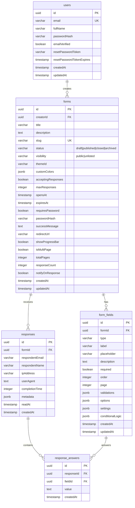

# 🧪 DexterForms

> A production-style, Typeform-inspired form builder SaaS — built with a modern full-stack TypeScript monorepo and a 90s Dexter's Lab cartoon theme.

[](https://www.typescriptlang.org/)
[](https://nextjs.org/)
[](https://trpc.io/)
[](https://orm.drizzle.team/)
[](./LICENSE)

---

## ✨ Features

### Core Builder
- **12 Field Types** — Short text, long text, email, number, date, single/multi select, dropdown, checkbox, rating, phone, URL
- **Drag-and-Drop Builder** — Reorder fields with smooth DnD, live preview panel
- **6 Quick-Start Templates** — Contact Form, Feedback, Job Application, Event Registration, Survey, Bug Report
- **13 Themes** — Dexter, Minimal, Dark, Matrix, Sakura, Cyberpunk, Ocean, Nebula, Retro, Dracula, Naruto, Midnight, Startup

### Form Logic & Access Control
- **Conditional Logic** — Field-level show/hide rules (`eq`, `neq`, `contains`, `is_empty`, `is_not_empty` operators); evaluated live on the public form
- **Password-Protected Forms** — bcrypt-hashed password gate on the public form URL
- **Multi-Page Forms** — Split questions across up to 10 pages; per-field page assignment in the Field Editor; Next/Back navigation with per-page validation on the public form
- **Scheduled Publish / Auto-Close** — Set an `Opens At` date (form blocked until then) and a `Closes At` date (auto-closes after); both configurable from the builder settings

### Sharing & Discovery
- **Public Form Filling** — Shareable `/f/[slug]` links, no login required for respondents
- **QR Code Sharing** — Inline QR code popover for every published form
- **Embed Code** — One-click `<iframe>` snippet generator; copy to clipboard from the form builder top bar
- **Public Explore Page** — Browse all public forms at `/explore` with live search (debounced 400 ms)
- **Visibility Control** — `public` (searchable on Explore) or `unlisted` (link-only)

### Responses & Analytics
- **Response Management** — Browse, filter, and delete individual responses
- **Read / Unread Status** — Unread responses highlighted with orange indicator; auto-marked read on first open; unread count shown in the responses page header
- **Analytics Dashboard** — Per-field answer distributions, daily trend chart, completion time stats
- **CSV Export** — One-click download of all responses with full field labels

### Operations
- **Duplicate Forms** — Clone any form instantly
- **Form Archive** — Soft-archive forms (`status = archived`) to hide from active views without losing data; restore at any time
- **JWT Authentication** — Stateless auth via httpOnly cookie (`df_token`) + `Authorization: Bearer` header; 7-day tokens
- **Rate Limiting** — Auth endpoints: 10 req/15 min · Submission endpoint: 30 req/hr
- **Email Notifications** — Optional SMTP notification sent to form creator on new response
- **Interactive API Docs** — Scalar UI at `/docs`

---

## 🛠 Tech Stack

| Layer | Technology |
|---|---|
| Monorepo | Turborepo + pnpm workspaces |
| Frontend | Next.js 16 (App Router, Tailwind CSS v4) |
| API | tRPC v11 + Express 5 |
| Type Safety | Zod v4 (end-to-end) |
| Database | PostgreSQL 15 + Drizzle ORM |
| Auth | JWT (jsonwebtoken + bcryptjs) |
| UI Components | shadcn/ui + Radix UI |
| Drag & Drop | @dnd-kit/sortable |
| Charts | Recharts |
| API Docs | Scalar (trpc-to-openapi) |

---

## 🗄 Database Schema

### ER Diagram



### Key Column Notes

| Column | Table | Details |
|---|---|---|
| `status` | `forms` | `draft` → `published` → `closed` / `archived` (soft-delete) |
| `opensAt` | `forms` | Form returns FORBIDDEN until this timestamp passes (scheduled publish) |
| `expiresAt` | `forms` | Form auto-closes after this timestamp (auto-close) |
| `isMultiPage` | `forms` | Enables multi-page mode; `totalPages` sets the page count (max 10) |
| `requiresPassword` | `forms` | Enables bcrypt password gate; hash stored separately in `passwordHash` |
| `page` | `form_fields` | Page number (1-indexed) for multi-page forms; ignored when `isMultiPage = false` |
| `conditionalLogic` | `form_fields` | `{ showIf: [{ fieldId, operator, value }] }` — all rules must match (AND logic) |
| `readAt` | `responses` | `NULL` = unread; set to current timestamp on first open in the responses panel |

### Migrations

| File | Changes |
|---|---|
| `0000_dusty_morg.sql` | Initial schema — users, forms, form_fields, responses, response_answers |
| `0001_faulty_tyrannus.sql` | Added auth fields, form settings columns |
| `0002_swift_midnight.sql` | Added conditional logic, password, multi-page, scheduling, visibility columns |
| `0003_rare_ted_forrester.sql` | Added `reset_password_token`, `notify_on_response` |
| `0004_multi_page_read_status.sql` | Added `opens_at` to forms; `read_at` to responses |

---

## 🚀 Local Development

### Prerequisites
- Node.js >= 20
- pnpm >= 9
- Docker + Docker Compose

### 1. Clone & Install

```bash
git clone <your-repo-url> dexterforms
cd dexterforms
pnpm install
```

### 2. Start Database

```bash
docker-compose up -d
```

### 3. Environment Setup

```bash
# .env is auto-loaded by Docker Compose defaults — no changes needed for local dev
# To customise, copy and edit:
cp .env.example .env
```

### 4. Run Migrations & Seed

```bash
pnpm db:migrate    # Apply schema to DB
pnpm db:seed       # Seed demo user + 3 sample forms
```

### 5. Start Dev Server

```bash
pnpm dev
```

| Service | URL |
|---|---|
| Frontend | http://localhost:3001 |
| API | http://localhost:8000 |
| API Docs | http://localhost:8000/docs |

### Demo Login

```
Email:    demo@dexterforms.dev
Password: Demo@123456
```

Demo forms available at:
- `/f/stranger-things-fan-survey`
- `/f/anime-character-survey`
- `/f/startup-pitch-validator`

---

## 📁 Project Structure

```
.
├── apps/
│   ├── api/                  # Express + tRPC API server (port 8000)
│   │   └── src/
│   │       ├── index.ts      # Entry point
│   │       └── server.ts     # Express app setup
│   └── web/                  # Next.js 16 frontend (port 3001)
│       ├── app/
│       │   ├── page.tsx              # Landing page
│       │   ├── pricing/              # Pricing page
│       │   ├── explore/              # Public form discovery + live search
│       │   ├── auth/                 # Login, Register, Forgot/Reset Password
│       │   ├── dashboard/            # Creator dashboard
│       │   │   └── forms/
│       │   │       ├── [id]/         # Form builder (fields, settings, theme tabs)
│       │   │       │   ├── responses/  # Response manager (read/unread, export)
│       │   │       │   └── analytics/  # Analytics dashboard
│       │   │       └── new/          # Create form wizard (templates)
│       │   └── f/[slug]/             # Public form (multi-page, password gate, conditional logic)
│       └── providers/
│           ├── auth.tsx              # JWT auth context
│           └── global.tsx            # React Query + tRPC setup
└── packages/
    ├── database/             # Drizzle schema, migrations, seed
    │   ├── models/           # Table definitions (form, form-field, response, user)
    │   └── drizzle/          # Migration SQL files + Drizzle meta snapshots
    ├── services/             # Business logic (auth, form, response, theme, email, user)
    ├── trpc/                 # tRPC router, context, procedures, routes
    └── logger/               # Shared logging utility
```

---

## 🔧 Environment Variables

### API (`apps/api`)

| Variable | Default | Description |
|---|---|---|
| `PORT` | `8000` | API server port |
| `NODE_ENV` | `development` | Environment |
| `BASE_URL` | `http://localhost:8000` | Public API base URL |
| `FRONTEND_URL` | `http://localhost:3001` | CORS allowed origin |

### Database (`packages/database`)

| Variable | Required | Description |
|---|---|---|
| `DATABASE_URL` | ✅ | PostgreSQL connection string |

### Auth (`packages/services`)

| Variable | Default | Description |
|---|---|---|
| `JWT_SECRET` | (change in prod!) | JWT signing secret |
| `JWT_EXPIRES_IN` | `7d` | Token lifetime |

### Frontend (`apps/web`)

| Variable | Default | Description |
|---|---|---|
| `NEXT_PUBLIC_API_URL` | `http://localhost:8000/trpc` | tRPC endpoint for browser |
| `NEXT_PUBLIC_APP_URL` | `http://localhost:3001` | App base URL |

### Email (optional)

| Variable | Description |
|---|---|
| `SMTP_HOST` | SMTP server hostname |
| `SMTP_PORT` | SMTP port (usually 587) |
| `SMTP_USER` | SMTP username |
| `SMTP_PASS` | SMTP password |
| `SMTP_FROM` | Sender address |

---

## 📜 Scripts

```bash
pnpm dev           # Start all apps in watch mode
pnpm build         # Build all apps for production
pnpm db:generate   # Generate Drizzle migration files
pnpm db:migrate    # Apply pending migrations
pnpm db:seed       # Seed demo data
pnpm db:studio     # Open Drizzle Studio (DB GUI)
```

---
